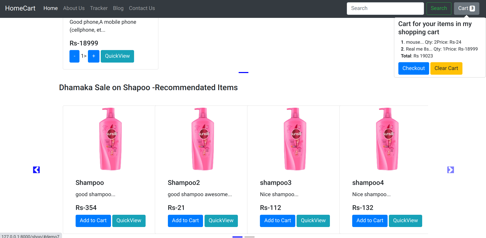

 # HomeCartWithCWH
 --Django Web Framework ,along with Bootstrap for frontend,
 -- inspired by CodeWithHarry -Youtube Channel
 --IF you want to use this ,make sure that in mac>settings.py you update the SECURITY KEY with your own and secure it.
### Welcome Page

-------------------------------------------------------------
### Our Shopping page

-------------------------------------------------------------
### Checkout Page

-------------------------------------------------------------

## mac is our project.

